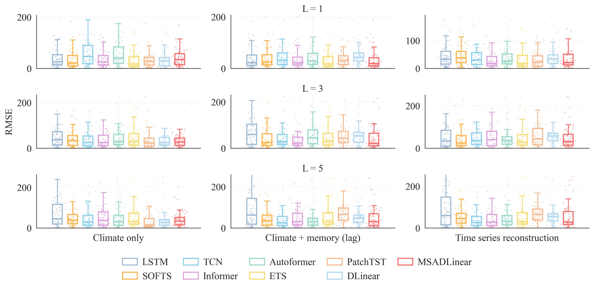
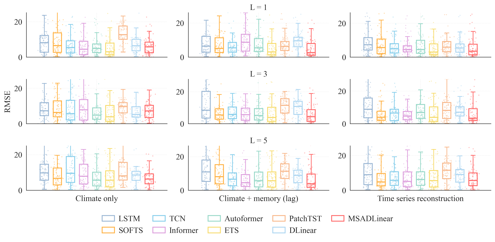
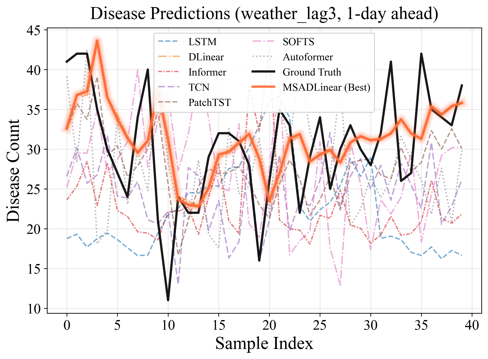
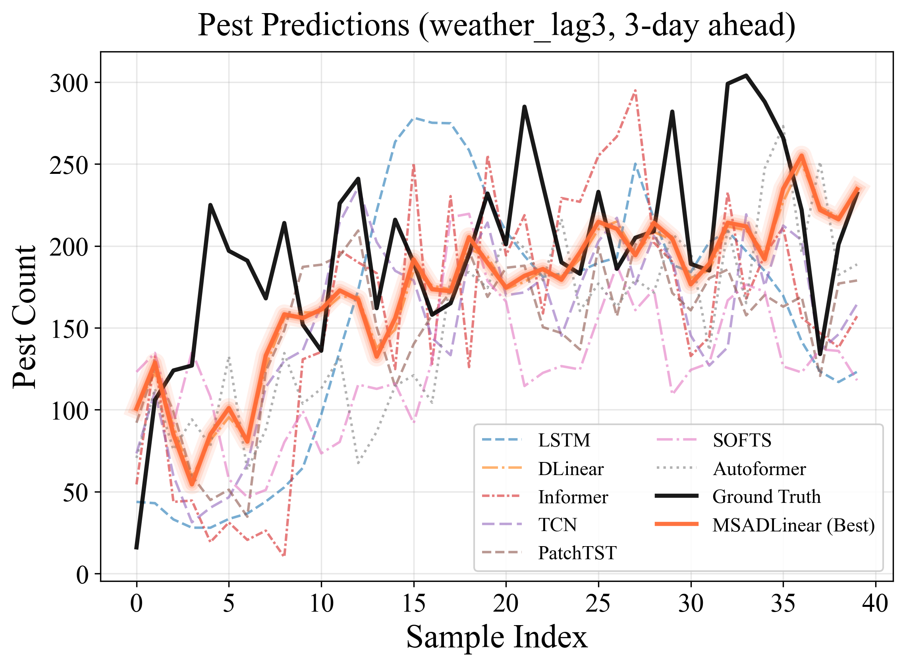

<div align="center">

# MSADLinear

**Multi-Scale Adaptive DLinear for lightweight, knowledge-guided short-horizon forecasting of crop pests and diseases**

[](https://www.python.org/)
[](https://pytorch.org/)
[](#overview)
[](#reproducibility-notes)

[Overview](#overview) | [Installation](#installation) | [Data](#data) | [Quick Start](#quick-start) | [Results](#included-results) | [Reproducibility](#reproducibility-notes)

</div>

## Overview

MSADLinear is a compact forecasting framework for short-horizon crop pest and disease monitoring under non-stationary environmental conditions. The implementation combines a linear forecasting backbone with reversible normalization, adaptive multi-scale decomposition, and dynamic cross-channel aggregation. It also includes experimental knowledge-constraint modules that can incorporate externally generated priors without replacing the data-driven forecast.

This repository contains:

- the MSADLinear implementation (named `GModel` in the source code);
- experiment scripts for two aphid-monitoring datasets;
- experiment interfaces for regional Plant Electronic Medical Record (PEMR) time series;
- seven neural forecasting baselines and one statistical baseline;
- optional LLM/knowledge-prior constraint modules;
- example result summaries and publication-oriented visualizations.

> The repository is research code. It is intended to support method inspection and experiment reproduction, not to serve as a production forecasting service.

## Method Highlights

MSADLinear is designed around four components:

1. **Reversible instance normalization (RevIN)** reduces the effect of distribution shifts between input windows.
2. **Adaptive multi-scale decomposition** extracts trend and seasonal/residual components using sample- and channel-dependent scale weights.
3. **Dynamic channel attention** aggregates multivariate environmental signals into a target-specific representation.
4. **Linear forecasting heads** preserve a lightweight prediction path, with an optional residual branch for direct target forecasting.

The repository also provides knowledge-guided variants that accept channel priors, scale priors, and confidence scores. These priors are introduced through confidence-aware soft constraints rather than hard replacement of learned weights.

## Repository Structure

```text
MSADLinear-main/
|-- README.md
`-- MSADLinear/
    |-- data/
    |   `-- Aphids_data/              # Bundled aphid-monitoring workbooks
    |-- exp/
    |   |-- Aphids_data/              # Aphid experiments and baselines
    |   `-- PEMRs/                    # PEMR experiments and baselines
    |-- model/
    |   |-- GModel.py                 # MSADLinear and dataset-adaptive wrappers
    |   |-- LLMExCon.py               # Knowledge-constraint variants
    |   |-- LLMExCon_Improved.py
    |   |-- LLMExCon_V5.py
    |   `-- ...                       # Baseline model definitions
    |-- result/                       # Aphid result summaries and figures
    `-- result2/                      # PEMR result summaries and figures
```

Implemented comparison methods include Autoformer, DLinear, ETS, Informer, LSTM, PatchTST, SOFTS, and TCN. ETS is currently used only in the aphid experiments.

## Installation

Create an isolated Python environment and install the required packages:

```bash
# After cloning or downloading the repository
cd MSADLinear-main/MSADLinear

python -m venv .venv
```

Activate the environment:

```bash
# Windows PowerShell
.venv\Scripts\Activate.ps1

# Linux or macOS
source .venv/bin/activate
```

Install the dependencies:

```bash
python -m pip install --upgrade pip
pip install torch numpy pandas scikit-learn statsmodels tqdm openpyxl matplotlib seaborn
```

For CUDA acceleration, install the PyTorch build that matches your CUDA runtime. All experiment scripts automatically fall back to CPU when CUDA is unavailable.

## Data

### Aphid monitoring data

The repository includes two Excel workbooks:

```text
data/Aphids_data/coxilia_data.xlsx
data/Aphids_data/passo_fundo_data.xlsx
```

The loader retains numeric columns, detects the target using a column name containing `aphid` (or falls back to the last numeric column), and fills internal missing values by forward-fill and backward-fill operations.

### PEMR regional time series

The PEMR workbooks are not distributed in this repository. To run the PEMR experiments, prepare the following files:

```text
data/PEMRs_data/Crop_diseases_data.xlsx
data/PEMRs_data/Crop_pests_data.xlsx
```

The disease workbook must contain a numeric target column named `病害`, and the pest workbook must contain a numeric target column named `虫害`. The remaining numeric columns are treated as explanatory variables. Keep the time/index column first so that the loader can preserve chronological order.

Only de-identified and legally reusable PEMR data should be placed in this directory. Example summaries and prediction figures are retained under `result2/` so that the output format can be inspected without distributing the original records.

## Quick Start

Run all commands from the `MSADLinear/` directory.

### Reproduce the MSADLinear aphid experiment

```bash
python exp/Aphids_data/gmodel_experiment.py
```

The script evaluates both bundled datasets at 1-, 3-, and 5-step horizons and writes its outputs to `result/GModel/`.

### Run a baseline

```bash
python exp/Aphids_data/dlinear_experiment.py
```

Replace `dlinear_experiment.py` with the corresponding experiment script to run another baseline.

### Run the PEMR experiment

After preparing the two PEMR workbooks:

```bash
python exp/PEMRs/gmodel_experiment.py
```

The script evaluates disease and pest time series at 1- and 3-step horizons and writes summaries, pointwise errors, and selected predictions to `result2/GModel/`.

### Generate the included visualizations

```bash
python result/01-蚜虫数据箱线图.py
python result2/02-visualize_pemrs_predictions.py
```

## Model API

The following example creates MSADLinear through the dataset-adaptive wrapper:

```python
import torch

from model.GModel import GModelWrapper

model = GModelWrapper.from_auto_config(
    input_size=5,
    seq_len=24,
    pred_len=3,
    scenario="auto",
)

x = torch.randn(16, 24, 5)  # [batch, input window, variables]
y_hat = model(x)            # [batch, forecast horizon]
```

For the PEMR-specific architecture, set `scenario="pemrs"`.

## Knowledge-Guided Variants

The files `LLMExCon.py`, `LLMExCon_Improved.py`, and `LLMExCon_V5.py` implement experimental knowledge-constraint modules. Their forward interfaces accept:

- `llm_p`: channel prior with shape `[batch, channels]`;
- `llm_q`: optional scale prior with shape `[batch, scales]`;
- `llm_conf`: prior confidence with shape `[batch]`.

The base and improved variants use confidence- and entropy-aware regularization, while the V5 variant additionally learns a mixture coefficient between model-derived and external channel weights.

These modules consume **precomputed numeric priors**. The repository does not include provider credentials, prompts, an online LLM client, or an end-to-end text-to-prior pipeline. Consequently, the standard experiment scripts run the data-driven forecasting models unless users explicitly implement and validate a prior-generation workflow.

## Experimental Protocol

| Dataset group | Input window | Horizons | Chronological split | Evaluated settings |
|---|---:|---:|---:|---|
| Aphid monitoring | 7 | 1, 3, 5 | 60% train / 40% test | original variables, target lags, and Takens reconstruction |
| PEMR disease/pest | 14 | 1, 3 | 70% train / 30% test | weather variables and weather plus target lags 1-3 |

The experiment scripts report MAE, RMSE, and SMAPE. Feature and target scalers are fitted on the training partition and then applied to the test partition.

## Included Results

The repository contains example outputs from the current experiment snapshot. They are provided to document file formats and support visual inspection; rerun the scripts in a controlled environment before using any values in a paper or benchmark table.

<table>
  <tr>
    <td width="50%" align="center"><b>Coxilha aphid forecast errors</b></td>
    <td width="50%" align="center"><b>Passo Fundo aphid forecast errors</b></td>
  </tr>
  <tr>
    <td></td>
    <td></td>
  </tr>
  <tr>
    <td width="50%" align="center"><b>PEMR disease forecast</b></td>
    <td width="50%" align="center"><b>PEMR pest forecast</b></td>
  </tr>
  <tr>
    <td></td>
    <td></td>
  </tr>
</table>

## Reproducibility Notes

- Experiments use chronological rather than random train/test splits.
- The current scripts do not enforce a single global random seed. For reportable results, set Python, NumPy, and PyTorch seeds and repeat each experiment across multiple seeds.
- The aphid pipeline computes STL-derived features before the chronological split to preserve the original experimental protocol. For strictly causal evaluation or deployment, recompute decomposition features using training data or rolling historical windows only.
- Result files in `result/` and `result2/` are experiment snapshots, not a versioned model release or a statistical claim across repeated runs.
- Exact results can vary with the PyTorch version, hardware, random initialization, and data preprocessing library versions.

## Citation

Paper and BibTeX metadata will be added after publication. Until then, please cite the repository URL and the release or commit used in your experiments.

## License

This repository does not yet include an explicit software or data license. Add the appropriate license and verify the redistribution terms of the bundled workbooks before making the repository public. Until a license is provided, reuse rights are not granted by default.

## Issues and Contributions

Bug reports, reproducibility questions, and focused improvements are welcome through GitHub Issues. When reporting an experiment, include the dataset, scenario, horizon, Python/PyTorch versions, hardware, and the complete command used.
